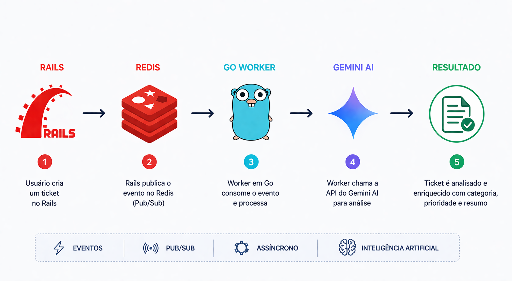

# Smart Ticket Triage

Sistema de classificação automática de chamados utilizando arquitetura orientada a eventos com Rails, Go, Redis e Gemini AI.

## Visão Geral

Este projeto demonstra uma arquitetura distribuída simples onde a criação de um ticket dispara um fluxo assíncrono de processamento e enriquecimento com inteligência artificial.

O objetivo é classificar automaticamente chamados técnicos, sugerindo categoria, prioridade e um resumo conciso.

## Arquitetura

* Rails responsável pelo CRUD de tickets
* Redis utilizado como barramento de mensagens via Pub Sub
* Go atuando como worker concorrente
* Gemini AI responsável pela análise e classificação dos tickets

Fluxo:

1. Usuário cria um ticket no Rails
2. Rails publica o evento no Redis
3. Worker em Go consome o evento
4. Worker chama a API do Gemini
5. Ticket é analisado e enriquecido

## Tecnologias

* Ruby on Rails
* Go (Golang)
* Redis
* Gemini API
* SQLite
* Docker

## Estrutura do Projeto

smart-ticket-triage/

* rails-app/
* go-worker/
* assets/

---

## Criando o projeto Rails (scaffold)

Dentro da pasta do projeto:

```bash id="5jmv4v"
rails new rails-app
cd rails-app
```

Gerar o scaffold:

```bash id="xg6g9c"
rails g scaffold Ticket title:string description:text status:string category:string priority:string ai_summary:text
```

Rodar migração:

```bash id="p2f3l6"
rails db:migrate
```

Subir aplicação:

```bash id="m0q6jw"
rails s
```

Abrir no navegador:

```text id="n4x0z3"
http://localhost:3000/tickets
```

---

## Como rodar o projeto

### 1. Subir o Redis

```bash id="d0yk8s"
docker-compose up -d
```

---

### 2. Rodar o Rails

```bash id="3q9n0e"
cd rails-app
bundle install
rails db:migrate
rails s
```

---

### 3. Rodar o worker em Go

```bash id="l1e4cx"
cd go-worker
go mod tidy
go run main.go
```

---

### 4. Configurar Gemini

Windows PowerShell:

```powershell id="jz6y5p"
$env:GEMINI_API_KEY="SUA_CHAVE_AQUI"
```

---

## Exemplo de uso

Crie um ticket com qualquer título e descrição.

O sistema irá:

* enviar o ticket para o Redis
* processar o conteúdo no worker em Go
* utilizar IA para gerar uma classificação automática

A saída será exibida no console do worker.

---

## Funcionamento Interno

### Publicação de eventos no Rails

```ruby id="1g3l0t"
class Ticket < ApplicationRecord
  after_create :send_to_queue

  def send_to_queue
    RedisPublisher.publish_ticket(self)
  end
end
```

---

### Service Redis

```ruby id="4l9p2d"
class RedisPublisher
  def self.publish_ticket(ticket)
    redis = Redis.new

    payload = {
      id: ticket.id,
      title: ticket.title,
      description: ticket.description
    }

    redis.publish("tickets", payload.to_json)
  end
end
```

---

### Worker em Go (resumo)

* conecta no Redis
* faz subscribe no canal `tickets`
* recebe JSON
* joga em channel
* processa com goroutine
* chama Gemini

---

## Conceitos aplicados

* Arquitetura orientada a eventos
* Pub Sub com Redis
* Processamento assíncrono
* Concorrência com goroutines e channels
* Integração com IA

---

## Autor

Felício Melloni
https://github.com/fjgmelloni
